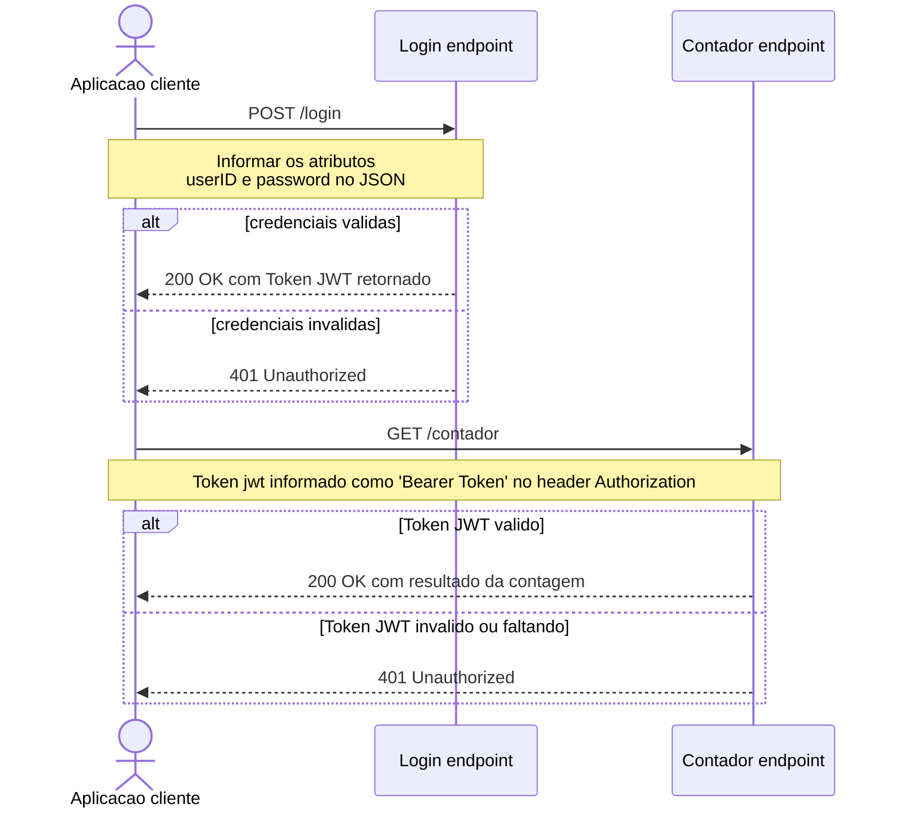

# ASPNETCore8-MinimalAPIs-JWT-Swagger-Extensions-Mermaid-HttpFiles-Mermaid_ContagemAcessos
Exemplo de API REST para contagem de acessos criada com o .NET 8 + ASP.NET Core + Minimal APIs, empregando extensões definidas em uma Class Library para utilização de JWT (JSON Web Tokens) e de configurações para que o Swagger suporte tokens. Inclui arquivos .http para testes a partir do Visual Studio Code.

---

## Fluxo básico

